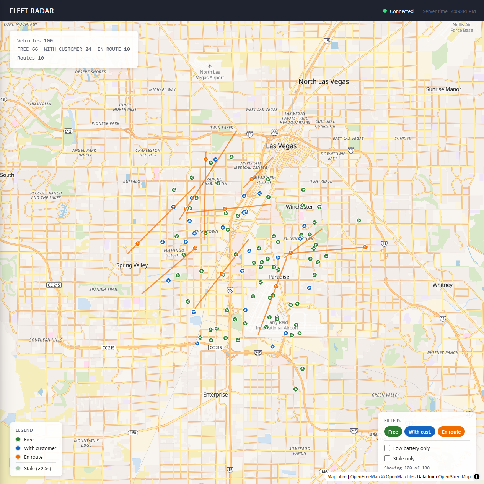

# Fleet Radar

This is my take-home for the Vay Fleet Radar prompt. It shows ~100 simulated EVs moving around Las Vegas in real time. The backend is wired up as if Kafka events were the source of truth; in practice the events flow through an in-process EventEmitter, so I'm modeling the pattern rather than running a broker.



- **Backend**: Node + Express, with a simulated Kafka-style event source feeding an in-memory store
- **Frontend**: React 19 + Vite + TypeScript, Zustand store, MapLibre GL JS + OpenFreeMap, styled-components
- **Transport**: WebSocket (snapshot on connect + 1 Hz batched telemetry + immediate route lifecycle events)

---

## Quickstart

Requirements: Node 22+, npm.

```bash
git clone git@github.com:DovahBrownies/vay-fleet-radar-react-ts.git
cd vay-fleet-radar-react-ts
npm install
npm run dev
```

`npm run dev` boots both processes in parallel (output prefixed `[server]` and `[web]`):

- Backend on `http://localhost:8787` (`/health` for a health check)
- Vite dev server on `http://localhost:5173`

Open `http://localhost:5173` to see the radar.

### Other scripts

| Script | What it does |
|---|---|
| `npm run dev:server` / `dev:web` | Run either process on its own |
| `npm run probe` | One-shot CLI WebSocket probe; logs the first few WS messages |
| `npm run lint` | ESLint over `src/`, `server/src/`, `shared/`, `scripts/` |
| `npm run build` | Production frontend bundle |

---

## Use of AI

Yes - an agentic AI was used. The 4-hour timebox is tight, so I used an agent to accelerate the typing while I directed the build. Architecture, conventions, and tradeoff calls were mine.

**What I drove:**
- **Tech**: Node + Express + `ws`, MapLibre (WebGL matters for the 1000-vehicle discussion), Zustand, OpenFreeMap (no API key), straight-line routes to fit the timebox.
- **Architecture**: producer → bus → consumer → store separation; simulator owning its own state; `routeId`-preservation invariant mirrored on both ends of the wire; one `isVehicleVisible` helper shared by the marker layer, route layer, and filter counter.
- **Conventions**: path aliases, `rem` over `px`, no magic numbers or strings, centralized colors, uppercase log prefixes, argument names with units (`timestampMs`, `stepMeters`, `bearingDeg`).
- **UX**: where each overlay sits on screen, which fields the details panel surfaces, filter chips that show exactly what's checked (checking adds a status to the visible set, unchecking removes it) rather than the inverse, and dimming stale vehicles instead of hiding them so the operator can still see them.

**Where I pushed back:** scope creep ("swappable for `kafkajs` later" - the brief said simulated is sufficient), magic strings sneaking back in, AI-flavored prose, the initial filter chip semantics.

**Where the agent worked its magic:** MapLibre data-driven expressions, catching React 19's purity rule violation (`Date.now()` in render would have been a subtle bug), and the `CLAUDE.md` build journal.

I reviewed every file, rewrote in places, and ran lint + type-check after each step. ~70% AI typing, ~30% me directing and refactoring. Architectural decisions were entirely mine.

---

## Architecture

```
                            SERVER (single Node process)
            ┌────────────────────────────────────────────────────┐
            │                                                    │
            │   ┌───────────┐    publish   ┌────────────────┐    │
            │   │ Simulator │────────────▶│  EventBus      │    │
            │   │ (producer)│  on topic    │  (EventEmitter)│    │
            │   └───────────┘              └───────┬────────┘    │
            │                                     │ subscribe    │
            │                                     ▼              │
            │                             ┌────────────────┐     │
            │                             │   Consumer     │     │
            │                             │   (reducer)    │     │
            │                             └───────┬────────┘     │
            │                                     │ upsert       │
            │                           ┌─────────┴─────────┐    │
            │                           ▼                   ▼    │
            │                    ┌────────────┐     ┌────────────┐
            │                    │ Vehicle    │     │ Route      │
            │                    │  Store     │     │  Store     │
            │                    └────┬───────┘     └────┬───────┘
            │                         └────────┬─────────┘       │
            │                                  ▼                 │
            │                          ┌──────────────┐          │
            │                          │  WS          │          │
            │                          │  Broadcaster │          │
            │                          └──────┬───────┘          │
            └─────────────────────────────────┼──────────────────┘
                                              │ WebSocket
            ┌────────────────────────────────▼───────────────────┐
            │           CLIENT (React + Vite)                    │
            │                                                    │
            │   WS client ──▶ Zustand store                     │
            │                       │                            │
            │     ┌─────────────────┼────────────────────┐       │
            │     ▼                 ▼                    ▼       │
            │   FleetMap        Overlays           VehicleDetails│
            │  (MapLibre        (Legend,           (right card   │
            │   + symbol/line   FilterPanel,        when a       │
            │   layers)         DebugPanel)         vehicle is   │
            │                                       selected)    │
            └────────────────────────────────────────────────────┘
```

### Event topics (simulated)

Three topics flow through one in-process EventEmitter:

| Topic | Payload | Producer | Consumer effect |
|---|---|---|---|
| `vehicle.telemetry` | `{ vehicleId, lat, lng, heading, battery, status, timestamp }` | Simulator, every 1s for every vehicle | `VehicleStore.upsert(...)` (preserves `routeId`) |
| `vehicle.route.assigned` | `{ routeId, vehicleId, polyline, assignedAt }` | Simulator, on new route | `RouteStore.upsert(...)`, patch `vehicle.routeId` |
| `vehicle.route.cleared` | `{ vehicleId, routeId, clearedAt }` | Simulator, on arrival | `RouteStore.remove(...)`, clear `vehicle.routeId` |

The simulator never reads from the stores. It owns its own state and just publishes outward. The stores are downstream projections, mutated only by the consumer.

### Wire format (server → client)

Four message types defined as a discriminated union in [`shared/types.ts`](shared/types.ts).

On connect, the client gets a `SNAPSHOT` (`vehicles[]`, `routes[]`, `serverTime`). After that, `TELEMETRY_BATCH` arrives once per second - the broadcaster coalesces events per `vehicleId` so each batch carries the latest state per vehicle. Route events (`ROUTE_ASSIGNED`, `ROUTE_CLEARED`) bypass batching and forward immediately, because they're rare and a stale route line would look wrong.

The frontend reducer in [`src/store/fleetStore.ts`](src/store/fleetStore.ts) switches on `message.type` and reduces into `vehiclesById` / `routesById` records. Two invariants live on both sides of the wire:

- **Telemetry preserves `routeId`** - route lifecycle owns it, not telemetry.
- **`ROUTE_CLEARED` only clears `routeId` if it still matches** - a stale clear shouldn't stomp a newer assignment.

Both rules also live on the server consumer ([`server/src/kafka/consumer.ts`](server/src/kafka/consumer.ts)).

---

## Data flow

End-to-end, an EN_ROUTE vehicle moves a meter west:

1. Simulator advances the vehicle and publishes a `TelemetryEvent`
2. Consumer reduces → `VehicleStore.upsert(...)`
3. Broadcaster buffers (keyed by `vehicleId`, latest wins)
4. Once per second, broadcaster flushes `TELEMETRY_BATCH` to all clients
5. Client parses → `store.applyMessage(msg)` → `vehiclesById` updates
6. Subscribed components re-render; `VehicleMarkers` rebuilds its `FeatureCollection`
7. MapLibre `setData(...)` → next frame paints with new positions

At 100 vehicles / 1 Hz:

- ~100 events/sec on the server bus
- 1 WS message/sec/client (deduplicated batch)
- 1 React render/sec per subscribed component (Zustand selectors prevent over-rendering)
- 2 GPU draw calls for markers + 1 for routes; fleet size doesn't change this
- ~15 KB/sec/client on the wire (~100 features × ~150 bytes)

---

## Operator UX

Each item maps to a bullet from the brief's user story:

| Need | UI |
|---|---|
| Where are cars located | Map dots (color per status) |
| What is each car doing | Status color; click → details panel |
| Which need charging | Battery color tier in details; "Low battery" filter |
| Send a field agent | "Dispatch field agent" button (mocked) |
| Areas with low coverage | No first-class UI; for now an operator just spots gaps on the map |
| Support a customer trip | "Support trip" button (mocked) |
| Stale telemetry | Markers dim to 40% opacity after 2.5s; "Stale only" filter |

Operators can also filter by status, low battery, or stale telemetry. The filters compose with AND, so each one narrows the visible set further. The bottom-left legend keeps the color and dimming conventions on screen, and a colored pill in the top bar shows the WebSocket connection state.

---

## Tradeoffs

What I cut to fit the timebox:

### No real Kafka
The brief allows simulation. Running a broker would have eaten most of the four hours without adding anything the brief is grading on.

### In-memory storage
Nothing is persisted to disk; both stores live in process memory and reset on restart. The brief allows this. The consumer is the only writer in either store, so swapping in a real database (Redis being the obvious choice for this shape of data) is a localized change to `consumer.ts` and the two store files.

### Straight-line routes
EN_ROUTE vehicles follow a straight line from A to B rather than real roads. The polyline type (`Route.polyline: LngLat[]`) already supports multi-waypoint routes, so upgrading later (via [OSRM](https://github.com/Project-OSRM/osrm.js) for real road-snapping, or pre-baked fixtures for offline use) is a single-function rewrite inside `simulator.ts`. The architecture doesn't change - it's only a visual upgrade - so I cut it to spend the time elsewhere.

### No unit tests
The discriminated-union types catch the most common mistakes at compile time. As a runtime check, the server logs a heartbeat every 5 seconds with three counters - total vehicles in the store, count with `status === EN_ROUTE`, and total routes in the route store - which should always agree. If they ever disagree, something dropped an event. If I had more time I'd write proper tests for the event bus delivery, the consumer reducer for each event type, and the route-arrival logic in the simulator.

### No visual polish
"Clarity over polish" is in the brief, so I focused on the functionality and skipped a real design pass. The colors and spacing are workable placeholders, not deliberate choices. Accessibility basics are in place (`aria-label`, `aria-pressed`, semantic heading levels), but I didn't go further than that.

### No persistent filter state
Filters reset every time you reload the page. Persisting them would be ten lines: a `useEffect` that reads the filter state from `localStorage` on mount and writes it back whenever filters change.

### Vehicle batteries drain to zero and don't return home
Battery drains over time (faster while EN_ROUTE), but I never simulated recharging or vehicles returning to a depot, so eventually every vehicle hits 0% and stays there. The brief's user story didn't call for it, so I left it out.

---

## Scaling to ~1000 vehicles

### What holds

Map rendering (MapLibre layers are single GPU draw calls regardless of feature count). The `EventEmitter` bus (1000 events/tick is microseconds). The in-memory `Map<id, Vehicle>` (~1 MB). All per-feature styling - color, opacity, rotation - is GPU-evaluated, so there's no per-vehicle JS cost on render.

### Where it starts hurting

The wire is the first bottleneck. 1000 features × ~150 bytes ≈ 150 KB/sec/client, plus JSON serialization on the server that scales linearly with fleet size. The cheap fix is to omit fields that haven't meaningfully changed since the last batch (a `heading` that drifted by 0.1° doesn't need to ship). The bigger lift is moving off JSON entirely to a binary format like Protobuf or FlatBuffers.

The client side has a less obvious cost: the reducer currently spreads the entire `vehiclesById` record to a new object on every batch (`{ ...prev, [id]: nextVehicle, ... }`). At 100 features that's nothing; at 1000 it's a noticeable allocation every second. I'd reach for Zustand's structural-sharing patch helpers, or switch the store to a `Map<id, Vehicle>` mutated in place behind a ref change so the reference equality works without the whole-object spread.

### Where the architecture pays off

The Kafka-style separation makes horizontal scaling straightforward. Shard by [H3](https://h3geo.org/) hex cell: each shard's consumer materializes its cell's vehicles; WS clients subscribe to whichever cells overlap their viewport. Simulator → N producers; bus → real Kafka with cell-keyed topics; stores → Redis. The wire format, reducer, and marker layer don't change.

### Two more client-side wins

- **Viewport culling**: filter the FC by `map.getBounds()` before passing to `<Source>`. Off-screen vehicles don't enter the GPU pipeline.
- **Overlapping click targets**: `queryRenderedFeatures` returns all hits - present a small list at the click point rather than picking arbitrarily.
